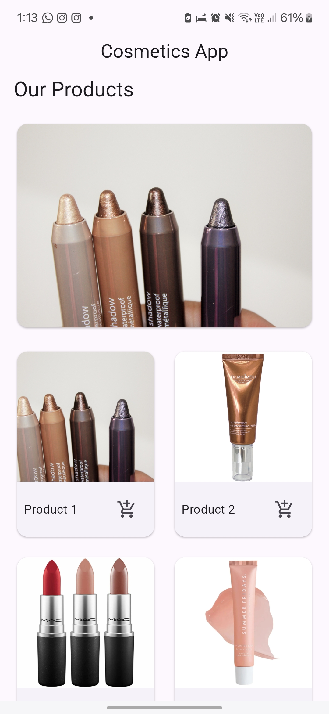
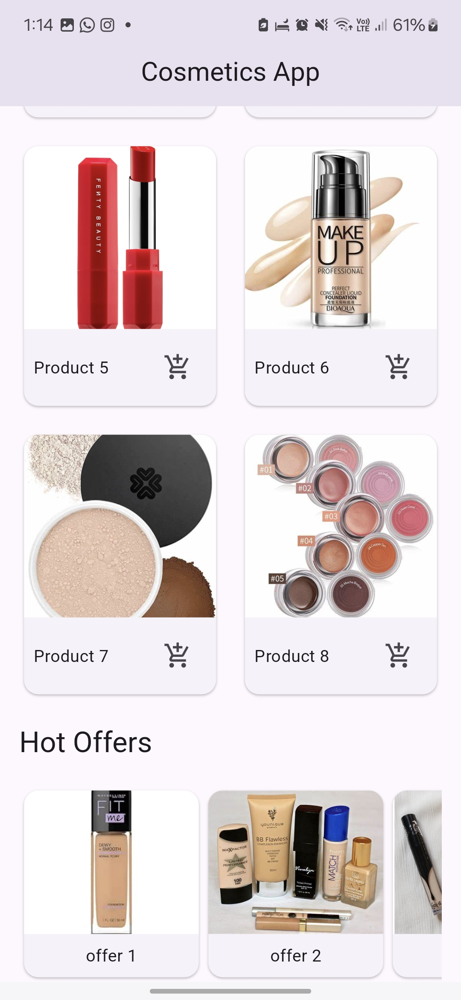
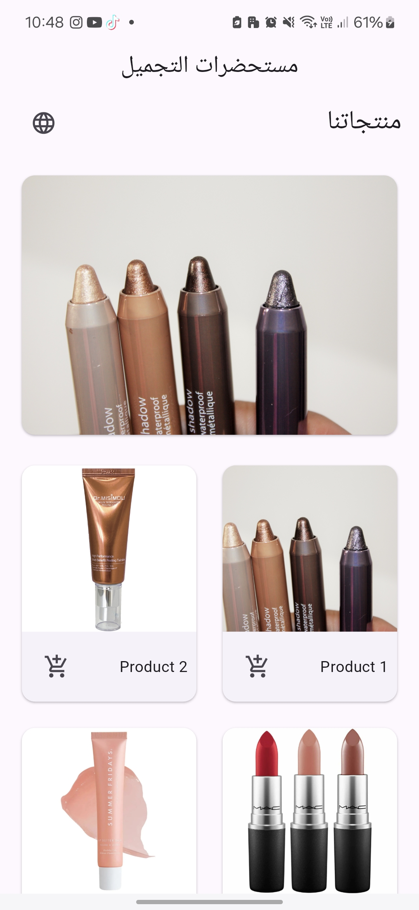
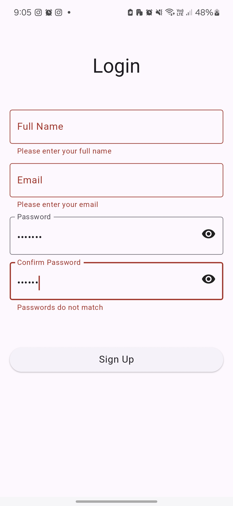
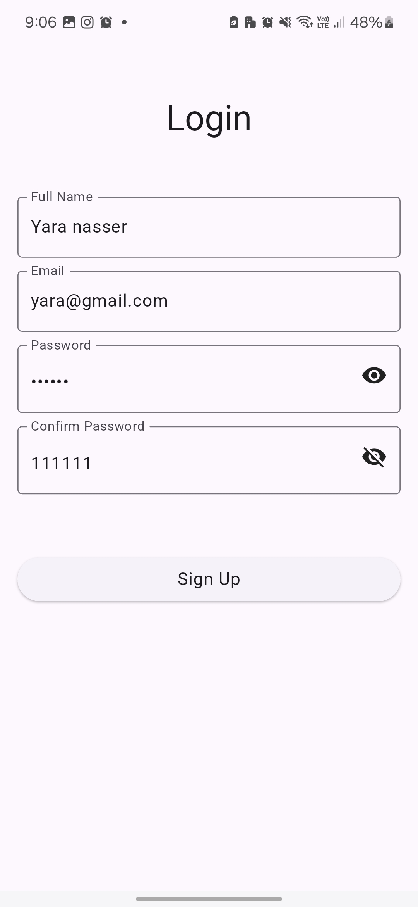
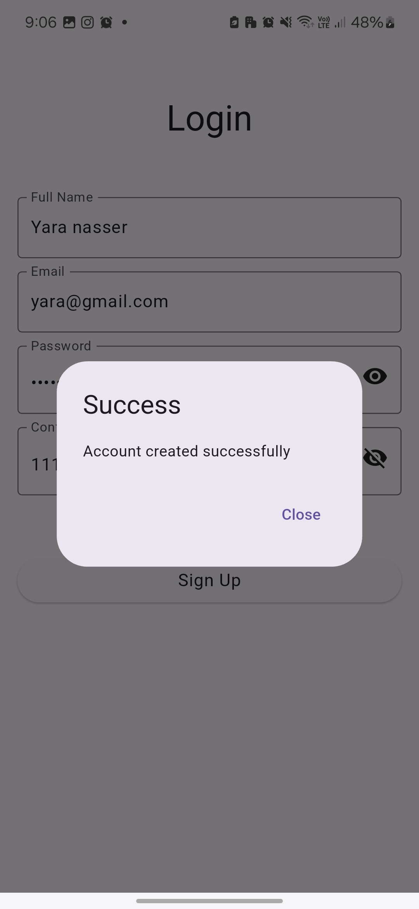
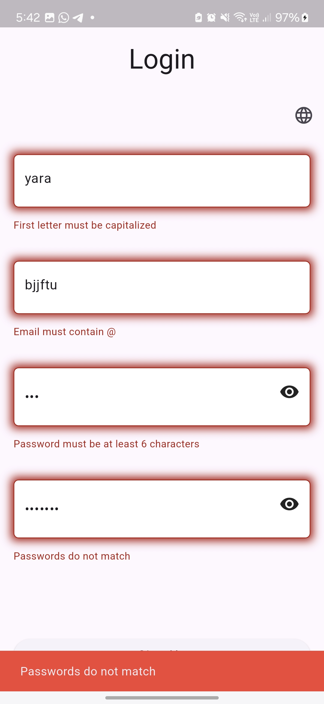
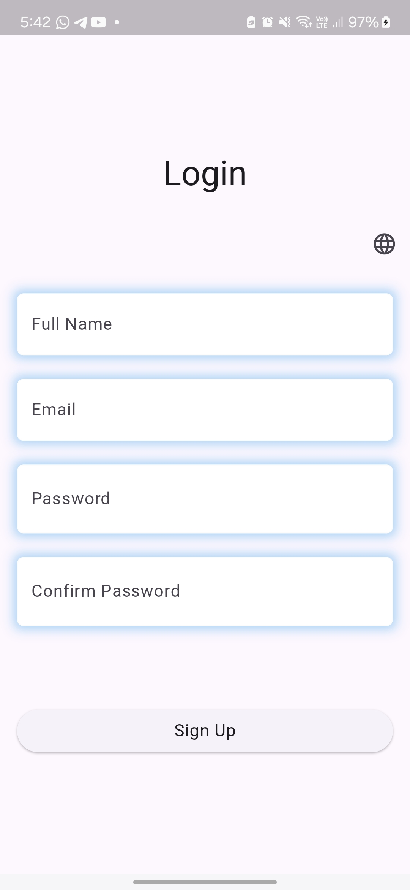
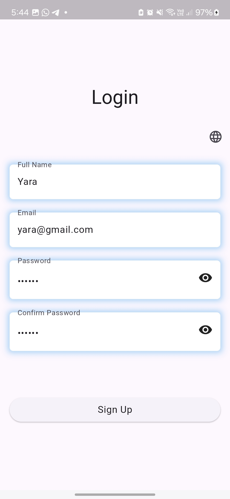

# 💄 Cosmetics App 

A simplified version of a shopping app interface built with Flutter, featuring a responsive design with multiple sections displaying products and hot offers.

## 📸 Screenshots

    
    
    

***

    
    
    

***
#### add shadow to the Text Form Field (just a UI update)

    
    
    

### demo

<video width="300" height="" controls>
  <source src="readme/demo.mp4" type="video/mp4">
  Your browser does not support the video tag.
</video>

